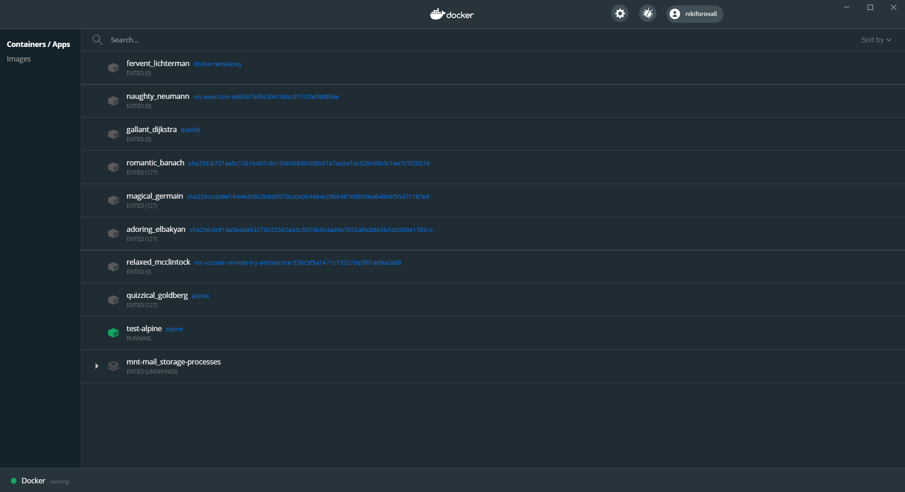

# DEMO: Running docker second time

1. Open docker dashboard
2. 
3. Run `docker container run --rm --interactive --tty alpine`
   1. Mention: `--detach`
4. Inside container run:
   1. `whoami` 
   2. `hostname`
   3. `top`
   4. `date && cal`, interestingly date is shared from host
   5. `echo 'echo running...' > script.sh`
   6. `chmod +x ./script.sh`
   7. `./script.sh`
5. Open new pane: split (without closing of first terminal)
   1. Run `docker container exec --workdir / <id> /bin/sh h1.sh`
6. Show detached mode
   1. `docker container create -it --name demo1-alpine alpine`
   2. `docker container attach demo1-alpine`
   3. `docker container attach demo1-alpine`
   4. `find . -name *.sh`
7. Run `docker container top demo1-alpine`
8. Run `docker container logs demo1-alpine --follow`
9. Open new pane: split
10. Run `docker container inspect demo1-alpine | code - &`
    1. Id
    2. State
    3. Image
    4. LogPath
    5. Mounts
    6. NetworkSettings
11. `docker container rm --force <id>`

### Bonus

* Let's see how we can use docker not only for running code, but also to install and run various tools so it increase productivity
* Let's see how to browse docker hub and search for images

* Run vscode command: "Docker Hub: Open in Browser"
* On Docker Hub: search for dotnet-script
  * show tag section and explain how images are versioned and resolved
    * `docker info -f='{{.IndexServerAddress}}'`
    * `docker pull index.docker.io/hjerpbakk/dotnet-script:latest`
      * <registryUrl>/<dockerId>/<imageName>:<tag>
  * show dockerfile section
* Run dotnet REPL
  * `docker images | grep dotnet`
    * Consider to use Id instead.
  * `docker run --rm -it hjerpbakk/dotnet-script`
    * `var d = DateTime.Now;`
    * `d.ToLongDate()`
* Let's run script that is located outside of container.
  * `docker container run -it --rm --mount type=bind,source="C:\\Nikiforov\\dev\\docker-for-dotnet-dev\\demos\\1-demo",target=/scripts,readonly --workdir=/scripts --name dnscript 587 main.csx -- Oleksii`
* Let's see what mount does
  * `docker inspect dnscript | jq '.[0].Mounts'`
  * DEBUG: `docker container exec -it dnscript /bin/sh`
  * <https://github.com/docker/for-win/issues/4812>

## Concepts & Ideas

* 💡 interactive mode
* 💡 containers are disposable, lightweight and it is easy to manage them
* 💡 how to manage docker containers and get more information
  * `docker container top`
  * `docker container inspect`
  * ...
