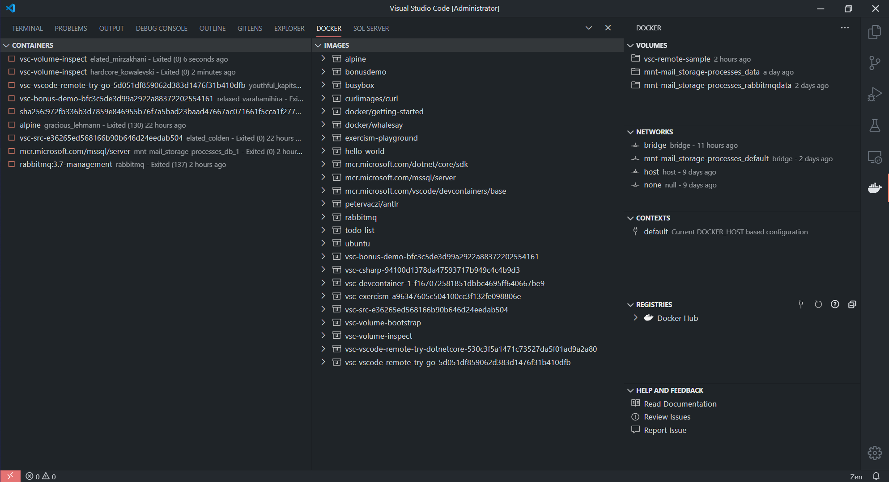

# DEMO: Bonus

All you need is vscode + vscode.ms-vscode-remote.vscode-remote-extensionpack, docker and you can start developing dotnet core application on your machine. 🚀


## Tye, Dapr, Steeltoe

* <https://github.com/dotnet/tye/tree/master/samples/apps-with-core-angular>
* <https://github.com/dapr/dapr>
* <https://steeltoe.io/>

## Dev containers

1. remote-containers.trySample
   1. Select **Go** template
   2. Serve a goo server and browse url
   3. explain how docker container mounts and build dev container, show volume in vscode.docker extension
      1. when you open volume in container, it is not a dev container but rather different remote option to check folumes easily
      2. 
2. bonus demo 🐳 📦

## Script

Inside container:

```bash
docker build -t bonusdemo:latest . | tee bonusdemo.build.log
docker container run --rm --name todo1 -d -P bonusdemo
docker container run --rm --name todo2 -d -P -v /var/run/docker.sock:/var/run/docker.sock bonusdemo:latest
docker inspect <id> | code - &
docker rm -f $(docker ps -a -f ancestor=bonusdemo -q)
```

You can also use vscode extension to manage containers and volumes.

'Docker Images: Build iamge...'

## Concepts & Ideas

* 💡 Devcontainers allows to support developer-environment-as-code
* 👌 I don't have dotnet runtime installed in this devcontainer since I'm running docker inside docker, so the `.devcontainer/Dockerfile` contains bits to run a code.
