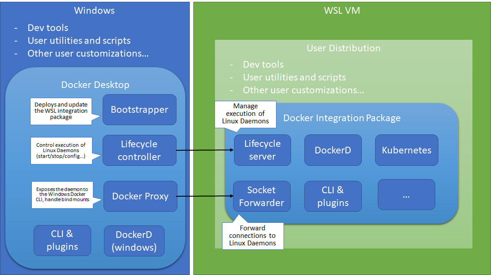

# Install docker

How do I get this awesome thing?

Entry point: <https://docs.docker.com/get-docker/>

* Modes/backends: Windows Containers vs Hyper-V vs WSL2

## Docker via Installer: Windows

* <https://docs.docker.com/docker-for-windows/>
* <https://docs.docker.com/docker-for-windows/install-windows-home/>

1. Download docker install from docker hub
   1. <https://hub.docker.com/editions/community/docker-ce-desktop-windows/> ⚡
2. Go through installation process. ~ 3-5 min install
3. `docker version`

Docker installer includes Docker Engine, Docker CLI Client, Docker Compose, Kubernetes and Credential Helper.

## Docker via Chocolatey: Windows

1. Get cholatey (unofficial package manager)
   1. <https://chocolatey.org/>

## Docker via Winget

Get Winget (official package manager) <https://github.com/microsoft/winget-cli>.

1. `winget search docker`
2. `winget show Docker.DockerDesktopEdge`
3. `winget install Docker.DockerDesktopEdge`

---

State of the art: Docker WSL2 provides better performance than legacy Hyper-V backend.

> The Advanced tab is only available in Hyper-V mode, because in WSL 2 mode and Windows container mode these resources are managed by Windows.

## Docker via WSL

Windows Subsystem for Linux adds a compatibility layer, which allows you to run the Linux binaries to the native Windows 10 OS—thus eliminating the need for the installation of Virtual Machine to run most command-line tasks.

WSL translates the Linux system calls returned by the process to the Windows kernel calls while a Linux Distro sits on top.

Docker daemon can't run directly in WSL, but you can use docker CLI to connect to a remote docker daemon running through Docker for Windows or any other VM.

Reference:

* <https://nickjanetakis.com/blog/setting-up-docker-for-windows-and-wsl-to-work-flawlessly>
* <https://github.com/CaliforniaMountainSnake/wsl-1-docker-integration>
* <https://fossbytes.com/what-is-windows-subsystem-for-linux-wsl/>

## Docker via WSL2

WSL 2 uses the latest and greatest in virtualization technology to run a Linux kernel inside of a lightweight utility virtual machine (VM).

<https://docs.microsoft.com/en-us/windows/wsl/compare-versions>

The primary goals of updating the Windows Subsystem for Linux to a new version are to increase **file system performance** and support full **system call compatibility**.

Select linux distro of your choice:
WinStore -> Linux -> Select version

! WSL 2 is only available in Windows 10, Version 1903, Build 18362 or higher.

Let see what linux subsystems we have:

* wsl -l
  
## Docker Online Playground

<https://labs.play-with-docker.com/>

